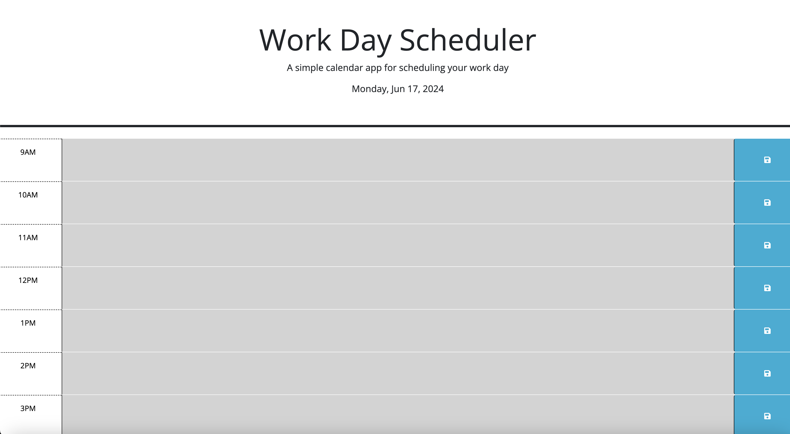

# day-scheduler

- Motivation

The motivation behind this project was to create a simple and effective way to manage a work day schedule.

- Why This Was Built

This was built to provide a user-friendly interface for scheduling tasks throughout a work day.

- What It Solved

This project solved the problem of managing and keeping track of tasks in a day. It provides a clear visual representation of the day's schedule, making it easy to see what tasks are coming up and what has been completed.

- What I Learned

Through this project, I learned how to effectively use jQuery to manipulate the DOM, how to use local storage to persist data, and how to use third-party libraries like dayjs to manage time.

## Table of Contents

- [Features](#installation)
- [How to Use](#how-to-use)
- [Usage](#usage)
- [Technologies Used](#technologies-used)
- [Local Development](#local-development)
- [Deployment Link](#deployment-link)
- [Credits & Resources](#credits--resources)
- [Lisence](#license)

## Features

- Dynamic time blocks for each hour of the work day
- Ability to save tasks in each time block
- Color-coded time blocks based on past, present, and future

## How to Use

1. Open the scheduler and view the time blocks for the work day.
2. Click on a time block to enter a task.
3. Click the save button to save the task to local storage.

## Usage

## Technologies Used

- HTML
- CSS
- JavaScript
- jQuery
- dayjs

## Local Development

To set up this project locally for development:

1. Clone this repository.
2. Open index.html in your browser.

## Deployment Link

[Click here to go to the deployed site](https://geoschu.github.io/day-scheduler/)

## Credits & Resources

[jQuery](https://jquery.com/)
[dayjs](https://day.js.org/)

## License

This project is open source and available under the [ISC License](LICENSE).
